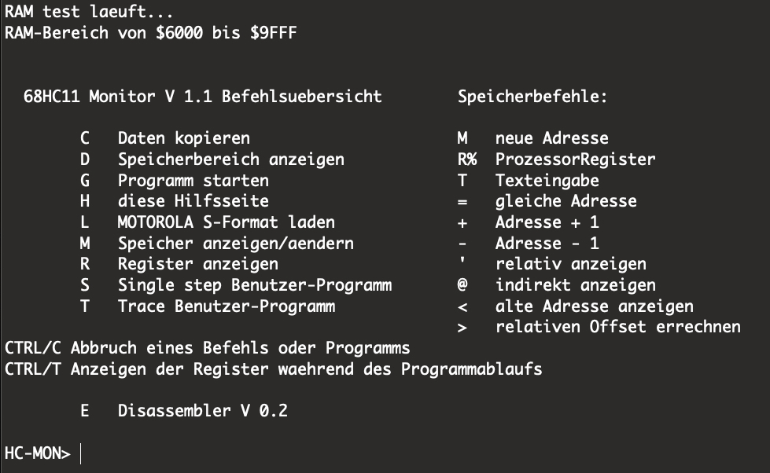

**HC-MON 68HC11**

This project is an advance embedded OS for the 68HC11 processor to debug assembler programs live on the chip.

It all started in the started during my studies in the late 80th at the “Fachhochschule der Deutschen Bundespost Berlin”.

Inspired by initial experiments with an SBC featuring the HD63701 and software running on it called ‘miniproz’, the project was further developed for an SBC based on Motorola’s 68HC11. The ‘miniproz’ software was developed by Prof. Dr. Th. Schiller on an Atari ST and include in the repro. 

The further development was named “HC-MON” and completed in the present version 1.1 in April 1991 in Dublin, Ireland.

**Main features of this OS are:**

-	Uploading user programs as Motorola s-records
-	Copy an edit data as needed
-	Monitor registers
-	Start, trace and single step user programs
-	Disassemble user programs 

